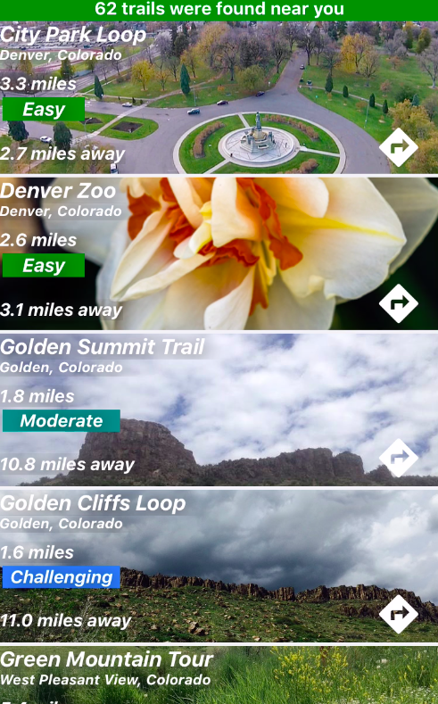

# Trailist

## About

Trailist allows for hiking customization, so finding the perfect trail is easier. 

Lists all the trails with the desired maximum LENGTH, DIFFICULTY level and DISTANCE using the user’s location.

## Installation

- Run `npm install` to install all the dependencies.
- Run `npm start` to host locally on an EXPO simulator or on your phone.

## Tech Used

- Node.js
- Express
- MongoDB
- Heroku
- React Native
- Cypress

## Server Side Repo

[Link](https://github.com/Gunacan/Capstone-Trailist-server)

## Author

#### [Onder Gunacan](https://github.com/Gunacan)
##### https://www.linkedin.com/in/onder-gunacan/
